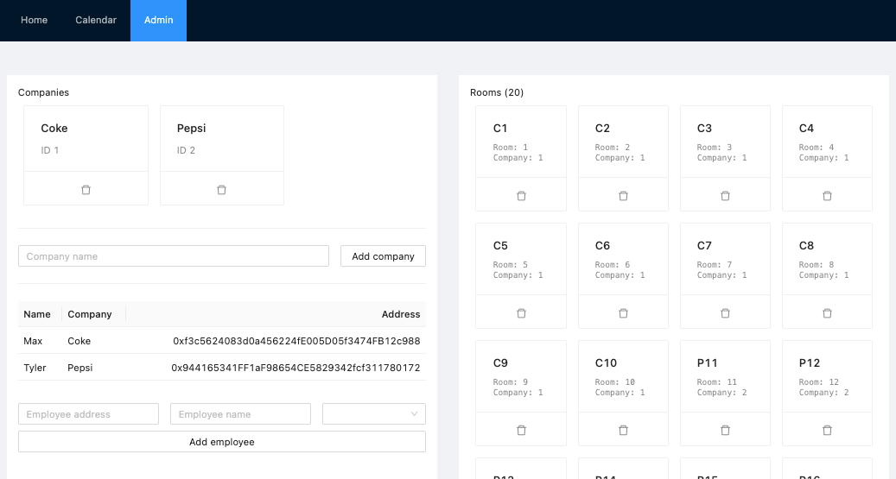

# BlockCal

> Fully decentralized blockchain based calendar.

## Specs

* Owner can create companies and assign rooms to them.
* Owner can create employees and assign them to companies.
* Employees can book a room for a given day slot.
* Employees can unbook their own booking.

## Description

* This is my first ever Solidity smart contract, please don't be too picky on the data structure and the code, I still need to learn the best practices and this was a complete discovery.
* I went with a simple CRUD data structure and the same contract owns the data, there's no proxy to a data store only contract.
* To develop the contract itself I went with TDD using [Hardhat](https://hardhat.org/) and then deployed on the Ropsten testnet to interract with the UI I built.

## How to run

* Clone the repository
* Create a `.env` and fill it according to `.env.example`
* Run `yarn && yarn deploy` copy the contract address and add it to `web/.env`
* Run `cd web && yarn dev` open your browser on `http://localhost:3000` and voilà!

## contracts/BlockCal.sol

* [0x8d48e5c896583c1aad7e40bec76c0d07e3fb75de](https://ropsten.etherscan.io/address/0x8d48e5c896583c1aad7e40bec76c0d07e3fb75de) (Ropsten)

### Public Methods

* `getCompanies()` -> `{ id: string; name: string }[]`
* `getEmployees()` -> `{ addr: string; name: string, companyId: string }[]`
* `getRooms()` -> `{ id: string; companyId: string }[]`
* `getBookedSlots()` -> `{ slotId: string; roomId: string; bookedBy: string; }[]`

### Owner methods

* `addComapny(name: string)`
* `removeCompany(id: string)`
* `addEmployee(name: string, companyId: string)`
* `removeEmployee(addr: string)`
* `addRoom(name: string, companyId: string)`
* `removeRoom(id: string)`

### Employee methods

* `bookSlot(roomId: string, slotId: string)`
* `unbookSlot(roomId: string, slotId: string)`

## Web UI

* The UI is built with [React](https://reactjs.org/), [ant.design](https://ant.design/) and [tailwindcss](https://tailwindcss.com/).
* For the deployment I went with [fleek](https://app.fleek.co/) which is linked to the repository and auto-deploys new commits to IPFS network.

### URLs

* [ipfs://Qmdzg1NENbwdh67qQVc1wi7gp6MWfQuugJtuL8XsF5eVV7](ipfs://Qmdzg1NENbwdh67qQVc1wi7gp6MWfQuugJtuL8XsF5eVV7)
* [https://silent-math-4212.on.fleek.co/](https://silent-math-4212.on.fleek.co/)

### Pages

* `/` -> connect to Metamask
* `/admin` -> administration interface to create companies, employees and rooms
* `/calendar` -> calendar interface to book and unbook slots for employees

### Known issues

* When switching profile into Metamask the contract is not updated, you must refresh the page
* Reloading the page doesn't save the last connected user

### Room for improvments

* Use multicall contract to fetch data for the UI
* The contract data and logic are stored in the same, this is a bad pattern. If you want to change your contrac logic you would have to migrate the data also.
  * Use external storage contract (https://github.com/fravoll/solidity-patterns/blob/master/docs/eternal_storage.md)
  * Use a proxy contract pattern (https://github.com/fravoll/solidity-patterns/blob/master/docs/proxy_delegate.md)
